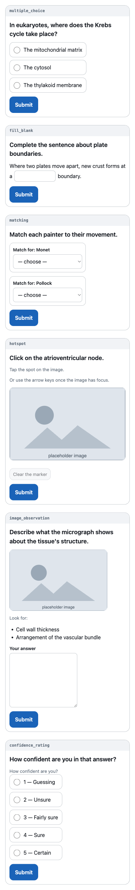
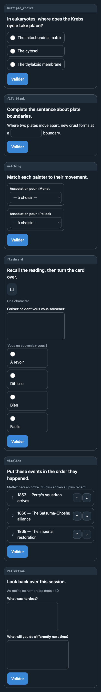
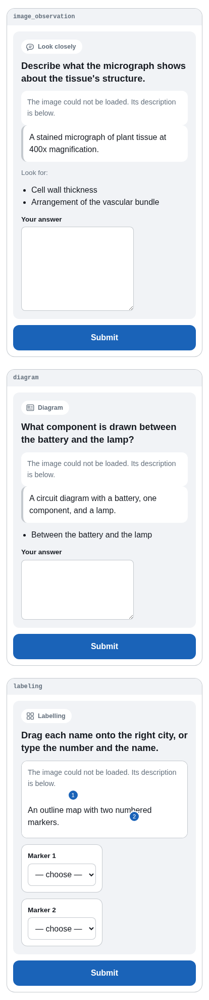

# hermes-learning-studio

A standalone [Hermes](https://hermes-agent.nousresearch.com) plugin for adaptive
learning: structured study sessions built on active recall and spaced
repetition.

> **Status: early development.** This is not the feature-complete public
> release. What exists today is a bundled skill plus four tools: two that
> remember a learner's **context** — their goals, level, preferences, and
> confirmed learning tracks — and one that validates and stores the
> **exercises** an agent designs, plus a secure managed-image importer, all in
> profile-scoped storage.
>
> There is now a **secure API** behind the optional `web` extra: a
> Telegram-authenticated FastAPI service that serves a stored exercise to its
> owner and collects their responses, plus the **Telegram Mini App** that renders
> it — all thirty-one component types, keyboard-operable, in three interface
> languages. See [Telegram Mini App API](#telegram-mini-app-api) and
> [The Mini App interface](#the-mini-app-interface).
>
> What is still missing is the **runtime around it**: no scoring engine, no
> scheduler, and nothing that starts a server or opens a tunnel, so nothing
> launches the Mini App yet. Responses collected by the API live in the session
> and are not marked or persisted. See [Roadmap](#roadmap) for what is still to
> come.

## Install

The supported way to install is Hermes' own plugin installer:

```bash
hermes plugins install victorbonnet/hermes-learning-studio --enable
```

For a specific Hermes profile:

```bash
hermes --profile <profile> plugins install victorbonnet/hermes-learning-studio --enable
```

Plugins are opt-in. `--enable` turns the plugin on as part of the install; drop
it and enable later with `hermes plugins enable learning-studio`.

Verify with `hermes plugins list`, or
`HERMES_PLUGINS_DEBUG=1 hermes plugins list` if the plugin does not appear.

### Alternative: clone into the plugins directory

```bash
git clone https://github.com/victorbonnet/hermes-learning-studio.git \
  ~/.hermes/plugins/learning-studio
hermes plugins enable learning-studio
```

### Alternative: pip install

```bash
pip install git+https://github.com/victorbonnet/hermes-learning-studio.git
hermes plugins enable learning-studio
```

This path registers the plugin through the `hermes_agent.plugins` entry point.
The entry point resolves to the `learning_studio` **module** (not
`learning_studio:register`), because Hermes calls `ep.load()` and then looks up
`.register` on the result — a `module:attribute` value returns the function
itself and fails with `Plugin 'learning-studio' has no register() function`.
`tests/test_entry_point.py` verifies the load path behaviourally, and the wheel
is installed into a clean virtualenv during verification to confirm it.

Managed image import uses Pillow, but plugin import, registration, context, and
exercise preparation do not. Package installs can opt into it with the
`media` extra:

```bash
pip install "hermes-learning-studio[media] @ git+https://github.com/victorbonnet/hermes-learning-studio.git"
```

For a directory-plugin install, install Pillow into the same Python environment
that runs Hermes. Without it, the plugin and its other three tools continue to
work; `learning_studio_import_asset` returns a safe, actionable error.

Managed publication also requires descriptor-relative filesystem operations
(`dir_fd`, `O_DIRECTORY`, and `O_NOFOLLOW`) so validation cannot be bypassed by
a directory-swap race. Platforms without those primitives, including Windows,
fail closed for `learning_studio_import_asset`; plugin registration, learning
context, and exercise preparation remain available. No pathname-only fallback
is used because it would weaken the managed-storage security boundary.

Numeric DPI/resolution metadata is accepted because it is structural and does
not carry an opaque payload. ICC profiles, EXIF/XMP, comments, text chunks, and
unrecognised application segments remain rejected because accepted source bytes
are preserved exactly and those containers can carry private arbitrary data.
If a database transaction fails after publication, retained live file and
managed-directory descriptors bind cleanup to the exact published inode: it is
truncated and locked to mode `000`; a zero-byte tombstone is safer than unlinking
a basename that a concurrent writer may have replaced.

## Usage

Ask the agent to load the skill:

```
skill_view("learning-studio:adaptive-learning")
```

Plugin skills are namespaced by the manifest name and are deliberately absent
from the system prompt's `<available_skills>` index — they are explicit,
opt-in loads.

The skill links a catalogue of exercise-format references, which the agent
opens one at a time rather than loading wholesale:

```
read_file("${HERMES_SKILL_DIR}/references/selection-cards.md")
```

`${HERMES_SKILL_DIR}` is substituted for the skill's real directory before the
content reaches the agent, so the path is concrete by the time it is read.

## Architecture

The repository is simultaneously a Hermes **directory plugin** and an
installable **Python package**, which drives the layout:

```
.
├── plugin.yaml                 # Hermes manifest: identity, kind, declared surface
├── __init__.py                 # Hermes entry point — thin shim exposing register()
├── learning_studio/            # Implementation package
│   ├── __init__.py             # Re-exports register(), owns __version__
│   ├── plugin.py               # register(ctx) — the whole host contract
│   ├── paths.py                # Profile-safe path resolution
│   ├── config.py               # Validated `learning_studio` config.yaml section
│   ├── models.py               # Context fields, provenance, validation
│   ├── storage.py              # SQLite connections and versioned migrations
│   ├── context.py              # Precedence resolution
│   ├── candidates.py           # Memory-candidate rules
│   ├── safety.py               # Content rules — inert text or nothing
│   ├── components.py           # The trusted component registry (31 types)
│   ├── manifest.py             # The experience envelope and its validation
│   ├── assets.py               # Lazy image validation and atomic managed copies
│   ├── service.py              # Reads, writes, ownership, consent gates
│   ├── schemas.py              # JSON schemas for the four tools
│   ├── tools.py                # Tool handlers
│   ├── telegram_auth.py        # Mini App initData verification (stdlib only)
│   ├── authorization.py        # Allowlist intersection — narrows, never widens
│   ├── sessions.py             # Expiring, opaque, in-memory Mini App sessions
│   ├── web/                    # Optional `web` extra — nothing else imports it
│   │   ├── dependencies.py     # The single injection point
│   │   ├── security.py         # Headers, body limits, rate limits, redaction
│   │   ├── static_files.py     # The static allowlist and the document policy
│   │   ├── app.py              # The protected API and the shell routes
│   │   └── static/             # The Mini App: no build step, no framework
│   │       ├── index.html      # Structure only — no data, nothing inline
│   │       ├── app.css         # Telegram-themed, mobile-first, safe areas
│   │       ├── i18n.js         # UI strings, separate from exercise content
│   │       ├── renderers.js    # One renderer per component type
│   │       └── app.js          # Launch, session, states, the only fetch caller
│   └── skills/
│       └── adaptive-learning/
│           ├── SKILL.md        # The orchestration workflow
│           └── references/     # Loaded on demand via read_file + HERMES_SKILL_DIR
└── tests/                      # Unit tests (fake context) + opt-in Hermes integration
```

The decisions that shape this foundation:

**One identity, two install paths.** Hermes derives a plugin's skill namespace
from its manifest `name` for directory installs, and from the entry-point name
for pip installs. `plugin.yaml` and the `hermes_agent.plugins` entry point in
`pyproject.toml` therefore both say `learning-studio`, so the skill resolves as
`learning-studio:adaptive-learning` however it was installed. A test asserts the
manifest name and the registered namespace agree.

**The entry point names a module, never `module:attribute`.** Hermes' loader is
`module = ep.load()` followed by `getattr(module, "register", None)`. A value of
`learning_studio:register` makes `ep.load()` return the function, which has no
`.register` attribute, so the plugin silently fails to load with a warning
rather than a traceback. The value is `learning_studio`, and
`tests/test_entry_point.py` loads it through `importlib.metadata` and asserts a
module comes back — including a test that the old value would *not* satisfy the
contract, so the guard cannot rot.

**The root shim uses a relative import.** Hermes loads directory plugins with
`spec_from_file_location(..., submodule_search_locations=[plugin_dir])` under
the `hermes_plugins` namespace — the plugin directory is never placed on
`sys.path`. An absolute `import learning_studio` would fail at runtime. The
shim also carries an absolute fallback for importers that load it as a
top-level module (pytest imports the ancestor `__init__.py` of any collected
test), and a test reproduces Hermes' exact loading mechanism to keep the live
path honest.

**Registration cannot fail.** `register(ctx)` is called at every Hermes startup
for every enabled plugin. It registers one skill, imports nothing optional, and
declares no `requires_env` — so enabling the plugin cannot break a session.
Pillow stays behind a lazy import inside the code path that needs it, and
FastAPI lives entirely inside `learning_studio/web/`, which nothing on the
plugin surface imports; a test blocks both modules at import time and asserts
registration still succeeds.

**One skill, many references.** The skill is a single orchestration workflow —
discovery, objectives, pedagogy, format selection, verification, activation,
interpretation, adaptation — with a catalogue of exercise-format references
beside it. The catalogue is *not* registered as fourteen skills; the agent
opens one reference at a time, so it pays for only what the current decision
needs. Tests assert that every reference is linked by a valid relative path,
that none is orphaned, and that the registered surface stays at exactly one
skill.

**References are opened with `read_file`, not `skill_view`.** This is a
correctness constraint, not a preference. Hermes' `skill_view` accepts a
`file_path` argument, but qualified `plugin:skill` names are dispatched to
`_serve_plugin_skill()`, which has no such parameter — the argument is dropped
and SKILL.md is returned again *with `success: true`*. An agent following that
idiom would silently re-read the same file instead of the reference it asked
for. So SKILL.md addresses references as
`read_file("${HERMES_SKILL_DIR}/references/<file>.md")`, the same token Hermes'
own bundled skills use for sibling files, and warns explicitly against the
`skill_view` route. `tests/test_hermes_integration.py` verifies both halves
against a real Hermes checkout, and fails if Hermes ever fixes the plugin path
so the workaround can be removed.

**The skill tells the truth about its own scope.** A skill that overstates what
exists sends the agent after tools that are not there; one that understates it
sends the agent to chat when a better route is available. `SKILL.md` therefore
names the four tools it has, says that a trusted renderer for all thirty-one
component types exists, and says just as plainly that **nothing launches it yet**
— so an exercise is prepared for that renderer and delivered in conversation until
the launch tooling lands. Textual contract tests pin the load-bearing rules: what
may launch without asking, that a missing tool falls back to chat, that the agent
writes validated manifests and never frontend code, that a learner never has to
name an internal skill for the workflow to start, that image assets come from real
tool results, and who owns which memory store.

**Subject-agnostic by construction.** No subject is the plugin's default.
Examples span language learning, programming, history, and science, and a test
fails if any one domain accounts for more than 40% of the examples in the
skill corpus or if a format reference illustrates fewer than three unrelated
subjects.

**Authorisation lives in the storage layer, not the handler.** Every
learner-owned query carries `profile_id` and `learner_id` in its `WHERE`
clause, so a handler that forgot an ownership check still could not read
another learner's track — there is no query that can. Foreign keys enforce
referential integrity; they do not decide who may read a row. Not-found and
not-yours return the same message, because distinguishing them would turn a
track ID into an oracle for whether another learner exists. Adversarial tests
try exactly that, with valid IDs belonging to someone else.

**Learner identifiers are not stored in the clear.** The principal is
converted to a salted HMAC digest with a per-database salt, so the platform ID
stays out of logs, backups, and a glance at the file, and precomputed tables
are useless against it.

This is *not* a claim that identity is unrecoverable. The salt lives in the
same database as the digests, so anyone holding the file can brute-force the
low-entropy space of platform user IDs offline. Resisting that needs a pepper
stored separately, with its own lifecycle and rotation story, and this plugin
does not mint secrets on a user's behalf. The digest is a lookup key; it is
never an authorisation check.

All primary keys are opaque generated tokens, so nothing keys on a label a
learner can change.

**Migrations are all-or-nothing.** All pending migrations run in one shared
transaction and roll back together on failure, because a half-applied schema
is harder to recover from than a failed startup. Explicit privacy and retention
migrations may purge rows that the current policy forbids keeping; unrelated
data is preserved and the cleanup rolls back with the upgrade batch on failure. A
database written by a newer version of the plugin is refused with an
explanation and left byte-for-byte untouched — deleting or "resetting" an
unfamiliar database would destroy a learner's record to make the code happy.

**`register()` opens no database.** It registers a skill and four tools and
returns. Initialising storage at startup would let a corrupt or
newer-versioned database take the whole plugin down, instead of failing one
tool call with a message the agent can act on.

**No mandatory runtime dependencies.** `dependencies` is empty, persistence
uses the standard library's `sqlite3`, and Pillow is isolated in the optional
`media` extra. Tests block FastAPI, Pillow, Telegram, HTTP clients, and PyYAML
at import time and still require the plugin and all four tool schemas to
register; only a real image import needs Pillow.

## Configuration

Behavioural settings belong in Hermes' `config.yaml`, under a single
`learning_studio` section. Secrets belong in `.env` — this plugin has none and
reads none. Every setting below is optional; the defaults shown are what
applies when the section is absent.

```yaml
learning_studio:
  # How long unconfirmed temporary context stays readable, in hours (1–8760).
  temporary_context_ttl_hours: 72

  # Upper bound on active tracks per learner (1–200).
  max_tracks_per_learner: 20

  # SQLite lock wait, in milliseconds (100–60000).
  busy_timeout_ms: 5000

  # wal | delete | truncate. WAL falls back automatically on filesystems
  # that cannot support it.
  journal_mode: wal

  # Independent observations before repeated evidence may be proposed as a
  # memory candidate (2–50).
  memory_candidate_min_evidence: 3

  # Deprecated compatibility switch. Accessibility is never stored. True
  # accepts and validates the old accessibility_consent audit payload for the
  # response only; false rejects that payload. Neither value permits storage.
  allow_durable_accessibility_needs: true

  # Longest single context value, in characters (80–20000).
  max_context_value_chars: 2000

  # Managed-image safety limits, enforced before and during decoding.
  max_asset_bytes: 10485760
  max_asset_width: 8192
  max_asset_height: 8192
  max_asset_pixels: 40000000

  # ── Telegram Mini App API (optional `web` extra) ─────────────────────
  # Behaviour only. The bot token stays in .env; there is no setting for it.

  # How long a Mini App session stays usable, in seconds (60–86400).
  mini_app_session_ttl_seconds: 1800

  # How old signed initData may be when a session is opened (30–3600).
  mini_app_init_data_max_age_seconds: 300

  # Largest accepted request body, in bytes (512–1048576).
  mini_app_max_request_bytes: 16384

  # Sliding-window rate limit, per Telegram user and per session.
  mini_app_rate_limit_requests: 60
  mini_app_rate_limit_window_seconds: 60

  # Upper bound on concurrently held sessions (1–100000).
  mini_app_max_sessions: 500

  # Optional NARROWING of the profile's Telegram allowlist. Empty means no
  # additional restriction. It can never add a user the profile excludes.
  mini_app_allowed_telegram_users: []

  # Context values that apply to everyone on this profile.
  profile_context:
    explanation_language: English

  # Last-resort values used only where nothing else is known. They never
  # overwrite anything stored or explicit.
  defaults:
    session_duration: 20 minutes
```

`profile_context` and `defaults` accept any of the context fields listed in
[Learning context](#learning-context).

**The section fails closed.** A malformed value raises rather than falling
back to a default, and an unknown key is an error rather than being ignored —
every setting here governs retention, isolation, privacy, or resource safety,
and a misspelled
`allow_durable_accessibility_needs` that silently degraded to "off" would look
exactly like the setting working.

### Storage

The database lives at:

```
$HERMES_HOME/workspace/learning-studio/learning-studio.sqlite3
```

resolved through the host's `get_hermes_home()`, so it follows the active
profile. Directories are created `0700` and the database `0600` where the
filesystem supports it. Each Hermes profile gets its own database; nothing is
shared between them.

Validated images are copied to the sibling `assets/` directory with opaque
filenames and owner-only permissions. Original source paths are never stored.

## Tools

Four tools, all in the `plugin_learning_studio` toolset. None takes a learner
argument: identity is resolved from the Hermes session, so a call always reads
and writes the record of whoever sent the current message.

### `learning_studio_get_context`

Returns the learner's context in three distinct parts, and never guesses:

- `temporary_context` — unconfirmed conversational evidence, which expires.
- `confirmed_context` — the durable context of a confirmed track.
- `resolved_context` — one value per field after precedence, each carrying its
  `provenance`, whether it is `confirmed`, and the `superseded` candidates it
  beat.

If a learner has several active tracks and the call names none,
`track_selection.mode` is `ambiguous` and the tracks are listed, so the agent
asks instead of studying the wrong thing.

### `learning_studio_save_context`

Saves temporary context, evidence, explicit corrections, confirmed tracks,
objectives, and memory candidates, all in one transaction. The response
reports exactly what became durable, what stayed temporary, and what was
refused and why.

**Creating a track requires `track.confirmed: true`.** Absence of the flag
means no durable track is created — the context is kept as temporary instead.
Repetition, agent confidence, and prior sessions are not confirmation, and no
code path treats them as such.

`outcome.not_stored` lists anything deliberately dropped, with a reason.

### `learning_studio_prepare`

Validates a complete **experience manifest** — an ordered set of exercise
components with their answer keys — and stores it transactionally. Returns an
opaque `experience_id` and a learner-safe summary.

The manifest is the UI contract. It is data, never renderer code: no tool here
generates HTML, and every string is checked to be inert text. See
[Exercise manifests](#exercise-manifests).

### `learning_studio_import_asset`

Imports PNG, JPEG, or single-frame WebP bytes from the active profile's trusted
Hermes image cache. It detects MIME from bytes, fully verifies the image,
enforces byte/dimension/pixel limits, requires meaningful alternative text (or
an explicit decorative declaration), rejects embedded private metadata, hashes
and deduplicates inside the exact learner/track scope, and atomically copies the
bytes into managed storage. On a duplicate, the first import's metadata remains
immutable and the response explicitly names any conflicting submitted fields.

The response contains an opaque `asset_id` and safe metadata. It never returns
or persists the original local path, and it never returns a stored generation
prompt. Visual manifest components accept only an asset owned by the current
learner in the experience's exact track scope, with the same alternative text
recorded at import. The tool does not generate images, serve files over HTTP,
or open a UI.

## Exercise manifests

An agent designs an exercise; this plugin decides whether it is storable. The
contract has three parts.

**A discriminated component registry.** Thirty-one component types across nine
families — selection, text input, ordering and matching, recall, visual,
timeline and process, structured, scenarios, and reflection. A component's
`type` selects exactly one specification; an unknown type is refused, and so is
any field that specification does not declare, at every level of nesting. The
registry is subject-neutral by design: `fill_blank` serves a chemistry equation
and a Spanish conjugation equally, and nothing privileges one discipline.

`code_response` collects and compares code **as text**. Nothing in this plugin
compiles, imports, or runs it, and a test parses every source file to prove
there is no `eval`, `exec`, `compile`, or `subprocess` anywhere that could.

**Visible and hidden are different places, not different names.** Each
component splits in two:

| Half | Fields | Where it goes |
| --- | --- | --- |
| Learner-visible | `id`, `type`, `prompt`, `content`, `accessibility` | `experience_components` |
| Evaluator-only | `answer`, `evaluation` (rubric, scoring, hints, feedback, branching, notes) | `experience_component_evaluations` |

The learner payload is **constructed from an allowlist**, not filtered. A field
that is not named in `LEARNER_VISIBLE_KEYS` cannot reach a learner, whatever a
future caller does, and nothing has to remember to delete anything. The split
runs all the way into the schema: the learner-facing table contains no answer
column, so a projection that forgets to exclude one still cannot leak a key.
The tool's own response is built from the visible half, so no answer travels
back through the model either. Tests put a distinctive canary in every hidden
field and assert recursively that none appears in the payload, the projection,
or the tool response.

**Inert text or nothing.** Every string — learner-visible and evaluator-only
alike — is refused if it contains markup, event-handler attributes, `javascript:`
or `data:` URLs, HTML entities, stylesheet syntax, any URL, a filesystem path,
`../` traversal, credential-shaped values, or invisible and bidirectional
characters. Hidden fields are held to the same rule because hidden today is not
hidden forever, and a store that already holds markup has to be sanitised on
the way out forever.

*A known limitation:* this makes it impossible to ship HTML, CSS, or JavaScript
**as subject matter** through a stored manifest — a lesson on the box model
cannot put `<div>` in a prompt. That is a deliberate trade while there is no
renderer, and those subjects are still teachable in conversation. Lifting it
needs a reviewed, explicitly escaped inert-code channel and the renderer that
would have to honour it.

**The schema and the runtime agree wherever a schema can say so.** Identifier,
locale and date patterns are published as strings and compiled from those same
strings; identifier lists reference the shared definition and advertise
uniqueness; bounded text advertises a pattern that refuses blank strings,
markup, and scheme-qualified URLs, generated from the same two declarations the
validator compiles; each component type advertises exactly the scoring modes it
accepts.

The rest of the content rules — paths, hosts, credential shapes, stylesheet
syntax — need alternation the two regex dialects disagree about, so they stay
runtime-only and the field description says so. Cross-field rules (an answer
that references an option, an objective that must match a stored one) are the
runtime's job too. `tests/test_schema_parity.py` runs representative invalid
values through a real JSON Schema implementation, the plugin's own validator,
and the manifest builder, so the agreement is *verified* rather than asserted —
and where the runtime is deliberately stricter, a test says which cases and
why.

The union of all 31 types is large — about 55 KB, of which the shapes every
type shares are emitted once under `$defs` rather than 31 times, cutting it
from over 140 KB. That is the price of a schema that refuses what the runtime
refuses; a future PR could trade it for a per-type lookup tool if the prompt
cost proves too high in practice.

**Accessibility metadata has one authoritative source: the operator.** An
experience declares `accommodations` from a closed vocabulary — captions,
transcript, text alternatives, visual description, keyboard-only, reduced
motion, no time limit, extended time, plain language — with
`source: profile_config`, checked against the profile's `config.yaml`. Matching
is exact on the canonical form, with no fuzzy, substring, or semantic step.

Two other sources existed and were removed, both for the same reason.
`explicit_request` was checked against the learner's temporary context — a row
the model had written in an earlier call. `confirmed_track` was checked against
a track's context, and one `save_context` call can create the track, set
`confirmed: true`, write the context, and supply the consent that supposedly
authorises it. A source a model can populate is not a source, so what remains
is a file a person edits.

**No accessibility need about a person is stored.** An accessibility need is
never written to storage, whatever consent accompanies it, and an `accessibility`
memory candidate is refused however it is presented. The consent statement, the
need, the track flag, the origin and the confirmation all arrive in one tool
call, written by one model, and Hermes exposes no confirmation event to check
them against. A gate whose every key is held by the party being checked is not
a gate. The need is honoured for the request that carries it, and the response
says plainly that nothing was kept.

**What the model asserts about the learner is recorded as the model's
proposal.** An `origin` claiming the learner stated, confirmed, corrected or
withdrew something is stored as `model_proposed`, and
`learner_confirmed`/`learner_declined` as `unconfirmed`. Hermes currently exposes
no host-backed confirmation event that could establish those claims. An owned
track proves scope, not that the learner spoke. `repeated_evidence` is
stored as sent, because it reports the agent's own observation. Every downgrade
is reported in the response. A replacement or removal must name a proposal
already stored for that learner.

**Candidate durability describes what actually happens.** `session` is returned
and never written, because this plugin has only durable SQLite and no
session-scoped store to be honest about. `short_term` is stored with an expiry
and swept on the next read. `durable` is kept.

There is deliberately **no free-text accessibility field** on the manifest. A
box to type in is a box a diagnosis eventually gets typed into, and this
metadata is neither consented to nor an appropriate place for one. Component
alt text and captions are free text, and are refused if they describe a person
rather than the component: a diagnosis, a disability label, or a sentence about
the learner cannot be stored. The same vocabulary stays legal in prompts and
content, because an exercise about glaucoma is an exercise about glaucoma.

**A declared accommodation must be deliverable.** `keyboard_only` alongside a
hotspot, labelling, matching, or drag-ordering component is refused unless that
component supplies a keyboard alternative; `captions` and `visual_description`
require the corresponding metadata on every asset-bearing component. Telling a
learner an exercise is usable when it is not is worse than claiming nothing.

Preparing an exercise writes no context, creates no track, and proposes no
memory candidate; exercise metadata never becomes a durable fact about a
person.

**Source references are described, not linked.** Title, author, publication
date, citation label, an approved source identifier, and a note. No URLs, no
paths, no credentials — this PR fetches nothing, so nothing may look
fetchable.

## Identity

The tools take no `learner_key`, `user_id`, or any other argument naming a
person, and a request containing one is refused. Identity comes from Hermes'
own session context:

```python
from gateway.session_context import get_session_env

get_session_env("HERMES_SESSION_PLATFORM")  # e.g. "telegram"
get_session_env("HERMES_SESSION_USER_ID")  # the platform's sender ID
```

The gateway binds those from the platform payload — for Telegram, the
message's `from.id` — before the agent runs, in a `contextvars.ContextVar`
that model output cannot reach. Hermes core trusts the same mechanism for
approval decisions.

The learner scope is `(profile, platform, sender ID)`, so the same numeric ID
on two platforms is two people, and one person keeps one record across their
DM and a group chat.

Those two variables are the plugin's entire dependency on host session state.
Conversation scope is deliberately not read: it played no part in
authorisation or storage, and `HERMES_SESSION_CHAT_TYPE` is not defined by
every Hermes version, so depending on it made behaviour vary by host for no
benefit.

**Anonymous multi-user sessions are refused.** If a gateway session is active
but carries no sender ID, the tools store nothing and say why, rather than
pooling strangers into a shared record. With no gateway at all — CLI, cron —
the profile is the principal, which is Hermes' own single-operator model.

A tool argument cannot override any of this, because there is no such
argument. That is the point: the previous design accepted a caller-supplied
`learner_key`, which meant anyone who could persuade the agent to pass a
guessed platform ID could read that person's record.

## Learning context

The context fields are deliberately subject-neutral — they describe *how*
someone is learning, never *what*, and no subject, language, or discipline is
the default:

`track_name`, `subject`, `goal`, `success_criteria`, `current_level`,
`target_level`, `prior_knowledge`, `knowledge_gaps`, `interests`,
`preferred_modalities`, `explanation_language`, `content_language`,
`session_duration`, `learning_horizon`, `assessment_preferences`,
`feedback_preferences`, `accessibility_needs`, `source_material`,
`constraints`.

### Precedence

Values disagree routinely. They resolve in this order, highest first:

```
current explicit request
  > explicit correction
  > active confirmed track
  > profile configuration
  > confirmed durable preferences
  > recent evidence
  > safe defaults
  > unconfirmed inference
```

Two consequences carry most of the weight. **What the learner says now wins** —
saved context never overrides someone who has just said something different.
And **defaults never overwrite anything**; they fill gaps. Resolution is
deterministic, and the losing candidates are returned rather than discarded so
a caller can explain why a value was chosen.

### Memory candidates are proposals, not writes

The plugin never imports, calls, or writes Hermes memory. It returns validated
*candidates*; only the agent decides whether any of them becomes a memory. The
save response says `hermes_memory_updated: false` every time.

A candidate may come only from an explicit durable preference, a confirmed
long-term goal, an explicit correction, an explicit withdrawal, or evidence
repeated often enough to be worth asking about. It may never come from one
error, one slow response, a single inference, momentary frustration, a raw
score, raw attempts, or session state — and it may never carry raw answers,
transcripts, session identifiers, tokens, credentials, or an inferred
disability or diagnosis.

Accessibility needs are **always session-only**, and session-only means absent
from the database rather than merely short-lived in it. Send them in
`current_request` to guide context resolution without storing them.

`accessibility_consent` is retained only as a compatibility/audit input. It is
validated and reported back, but cannot authorise persistence because the
statement and the need are both model-controlled:

```json
{
  "accessibility_consent": {
    "consent_statement": "please remember I need captions",
    "needs": ["captions on audio"]
  },
  "memory_candidates": [{
    "category": "accessibility",
    "statement": "captions on audio",
    "consented_need": "captions on audio",
    "origin": "explicit_durable_preference",
    "confirmation_state": "learner_confirmed",
    "evidence_summary": "Asked for this to be remembered"
  }]
}
```

The candidate in that example is returned as rejected and no accessibility
row is written. There is no model argument, consent quotation, confirmation
flag, or track record that changes this. Manifest accessibility metadata is
authorised only by operator profile configuration, which a tool call cannot
create or modify.

## Telegram Mini App API

An optional FastAPI service that serves a stored exercise to the person who
owns it, over a Telegram-authenticated, same-origin API, together with the
static Mini App that renders it. It is **not started by the plugin**: nothing in
this release launches a server, opens a tunnel, or sends a Telegram button. The
boundary and the interface exist; process lifecycle lands later.

```bash
uv pip install "hermes-learning-studio[web]"
```

Nothing outside `learning_studio/web/` imports FastAPI, and `register(ctx)`
never reaches that package — an install without the extra keeps a fully working
plugin, which tests assert by blocking the module at import time.

### Authentication

Every request carries the raw Telegram `initData` string in an
`X-Telegram-Init-Data` header, verified per Telegram's specification:

- the data-check string is every field except `hash` — sorted, `key=value`,
  joined with `\n`;
- the key is `HMAC-SHA256(key="WebAppData", data=<bot token>)`;
- the comparison is `hmac.compare_digest`, never `==`;
- `auth_date` must be recent (300 s to open a session) and no more than 60 s in
  the future, a stated tolerance for clients whose clocks run fast;
- the `user` object must name a real, non-bot numeric ID — and **only that ID
  is kept**. Names, usernames, language, and photo are discarded.

**`signature` is part of the signed data.** Telegram documents two validation
algorithms that exclude different fields, and mixing them up breaks
authentication outright:

| Algorithm | Used when | Excluded from the check string |
| --- | --- | --- |
| HMAC-SHA-256 with the bot token (**used here**) | the verifier holds the token | `hash` only |
| Ed25519 third-party signature | the verifier has no token | `hash` and `signature` |

Applying the Ed25519 exclusion to the HMAC path rejects every launch from a
client that sends `signature`, which current clients do. Both reference
implementations agree: `@telegram-apps/init-data-node` skips the field in
`validate3rd` and signs it in `validate`, and aiogram's
`check_webapp_signature` pops only `hash`. The test fixtures are built from
those implementations rather than from prose, and the default fixture carries a
`signature` field so the modern payload shape is what the suite exercises.

A launch from a group, supergroup, or channel is refused: a Mini App session
reads one person's learning record, which is not a room's business.

The bot token is read from `TELEGRAM_BOT_TOKEN` in `.env`, where Hermes already
keeps it. It is never copied into `config.yaml`, a database row, a response, a
log line, or a process argument, and the raw `initData` payload is never stored
anywhere.

### Authorisation is an intersection

```
effective access = profile Telegram DM allowlist  ∩  plugin restriction
```

`mini_app_allowed_telegram_users` can only **narrow** the profile side. There
is no setting that adds a user, because a plugin able to widen the host's
allowlist would be a privilege-escalation feature with a configuration file for
an interface.

A Telegram DM passes **two** gates in Hermes, in order, and a sender must clear
both. Mini App access is bounded by both, so it cannot exceed either.

1. **Adapter intake** —
   `plugins/platforms/telegram/adapter.py::_is_user_authorized_from_message`
   runs before batching, event construction, and the runner. Its own comment:
   *"Adapter-level allow_from / group_allow_from: when set, they are the sole
   authority."* The test is `if adapter_allow_from is not None`, so a present
   but **empty** `allow_from` authorises nobody, and a message from anyone
   outside it never reaches the rest of Hermes.
2. **Runner authorisation** —
   `gateway/authz_mixin.py::_is_user_authorized` then decides from
   `TELEGRAM_ALLOWED_USERS ∪ GATEWAY_ALLOWED_USERS` when any environment
   allowlist is configured, falling back to `allow_from` when none is.

`allow_from` is read from every shape Hermes accepts: `platforms.telegram` and
`gateway.platforms.telegram`, with the key written directly or inside `extra`
(`gateway/config.py` bridges the former into the latter).

The effective upper bound is therefore the intersection:

| `allow_from` | environment allowlist | Mini App upper bound |
| --- | --- | --- |
| present (ids) | configured | ids ∩ environment |
| present (ids) | absent | ids |
| present but empty | anything | nobody |
| absent | configured | environment |
| absent | absent | nobody |

Two earlier versions got this wrong in opposite directions, and both broadened
host access: unioning the two authorised anyone named in either, and letting
the environment *win* over a present `allow_from` authorised a user the adapter
drops at intake — with `allow_from: ["1001"]` and `TELEGRAM_ALLOWED_USERS=2002`,
Hermes never delivers a message from 2002, yet the Mini App would have admitted
2002. Intersecting is at least as strict as either gate alone, which is the only
property that makes "may narrow, never broaden" true rather than intended.

**`allow_admin_from` is not an authorisation source.** Hermes reads it only in
`gateway/slash_access.py`, to decide which *already authorised* users may run
privileged slash commands. Treating it as an access grant would let a user
excluded from Telegram entirely reach the Mini App.

### Deliberately not honoured

Each of these can only ever *deny* somebody Hermes would allow — never admit
somebody Hermes would deny — which is the safe direction for a plugin that has
promised never to broaden access:

| Not honoured | Why |
| --- | --- |
| `allow_from: ["*"]` and other wildcards | A wildcard opens a chat bot to everyone; it does not open one person's learning record to everyone. It grants nothing here — though, as in Hermes, it does remove the intake bound, so a wildcard beside an environment allowlist still authorises the users that allowlist names instead of denying them for the operator's choice of shorthand. Name the IDs. |
| `GATEWAY_ALLOW_ALL_USERS`, `TELEGRAM_ALLOW_ALL_USERS` | Same reason. |
| `TELEGRAM_GROUP_ALLOWED_USERS`, `TELEGRAM_GROUP_ALLOWED_CHATS`, `group_allow_from`, `group_allowed_chats` | Authorise participation in a room, not access to a personal record. Counted only when deciding whether *any* environment allowlist exists. |
| DM pairing approvals | A first-class grant in Hermes, stored outside configuration; reading it would mean reaching into host internals. Hermes writes approvals into the allowlist whenever one is configured, so the gap is narrow — the remedy is naming the user in `TELEGRAM_ALLOWED_USERS`. |

An empty allowlist authorises nobody, and a host configuration that cannot be
read raises rather than resolving to "empty".

### Sessions

Opening a session exchanges fresh `initData` and an `experience_id` for an
opaque random token, scoped to `(profile, Telegram user, learner, track,
experience)` and expiring after `mini_app_session_ttl_seconds`. Sessions live
in memory only — a bearer token is never written to the database or to disk,
and a restart ends every session. The store keeps the SHA-256 digest of the
token, so the token itself exists only in the response that minted it.

Both credentials are checked on **every** request: the Telegram payload and the
session token, and the token is refused if the Telegram account presenting it
is not the one it was minted for.

Telegram signs `initData` once, at launch, so the freshness bound for requests
*inside* a session is `session TTL + bootstrap window` — enough for a payload
that was already near the bootstrap limit to see the session out. Taking the
maximum of the two instead would quietly shorten every session opened with
slightly stale `initData`, returning 401 while the session store still
considered it live. The session's own hard expiry is what bounds its life, and
the advertised `expires_in_seconds` is the figure a caller actually gets. A
session may be continued with the launch that opened it or a newer one, never
with an older captured payload.

### Routes

| Method | Path | Purpose |
| --- | --- | --- |
| `GET` | `/api/health` | Authenticated liveness |
| `POST` | `/api/session` | Bootstrap a session for one experience |
| `GET` | `/api/session/component` | The component currently in view |
| `POST` | `/api/session/answer` | Record a response and advance |
| `POST` | `/api/session/reveal` | Turn a flashcard over, after an attempt |
| `GET` | `/api/session/result` | Progress summary for the session |
| `GET` | `/api/assets/{id}` | One managed image, verified on the way out |
| `GET` | `/`, `/index.html` | The Mini App document |
| `GET` | `/static/{app.css,i18n.js,renderers.js,app.js}` | The frontend, from a closed allowlist |

Every `/api/` route is authenticated. The five static files are the only public
ones — see [The Mini App interface](#the-mini-app-interface) for why a webview
shell cannot be — and no interactive docs or OpenAPI schema is published. Answers are recorded **in the session** and nothing is marked:
grading and durable attempt storage arrive with the evaluation runtime, and
every completion response says so rather than implying a score exists.

An asset is served only when the caller owns it *and* the session's own
experience references it, and its bytes are re-hashed against the recorded
digest on every delivery — an image swapped on disk after import is not served.

### What the API cannot leak

Responses are built from the stored **learner payloads**, which were
constructed from an allowlist when the experience was prepared and never
contained an answer key, rubric, hint, feedback string, or branch. The
evaluator-only tables are not queried anywhere in the web package. A test drives
the whole flow and asserts that no canary from any hidden field appears in any
response body.

Errors say as little as possible: an experience that does not exist, one owned
by another learner, and one in another profile are the same 404, and an
invalid, expired, or someone-else's session token are the same 401.

### Limits and headers

Per-user and per-session sliding-window rate limits, a bounded answer shape
(size, breadth, nesting), and a request body ceiling enforced **before**
buffering: an oversized or malformed `Content-Length` is refused having read
nothing at all, and a chunked body that declares no length is read chunk by
chunk and abandoned the moment the cumulative size crosses the limit. The peak
cost of an oversized request is one chunk, not the payload. Reading the body
and measuring afterwards would make the ceiling a formality — the memory is
already spent by the time the 413 is written.

On every response:

```
Content-Security-Policy: default-src 'none'; base-uri 'none'; form-action 'none';
  frame-ancestors https://web.telegram.org https://telegram.org;
  img-src 'self' data:; connect-src 'self'; script-src 'none'; style-src 'none';
  object-src 'none'
X-Content-Type-Options: nosniff
Referrer-Policy: no-referrer
Cache-Control: no-store, no-cache, must-revalidate, private
Cross-Origin-Opener-Policy: same-origin
Cross-Origin-Resource-Policy: same-origin
Permissions-Policy: accelerometer=(), camera=(), geolocation=(), …
Strict-Transport-Security: max-age=31536000; includeSubDomains
```

No CORS headers are ever sent, so a cross-origin page cannot read a response;
the required custom header means such a request needs a preflight this server
does not answer. `X-Frame-Options` is deliberately absent — it cannot express
"only Telegram", so `frame-ancestors` does that job alone.

Logs are structured JSON restricted to an allowlist of fields. A user appears
as a per-process pseudonym, a session as a digest prefix; the `initData`
payload, the bot token, and the session token never reach a log line.

That holds on the 500 path too, which is where it is easiest to lose. An
unexpected failure is recorded as `{"event": "unhandled_error", route, method,
status, reason}` where `reason` is the exception's *class name* — chosen by a
programmer — and **no exception message or traceback is logged at all**. A
failing query or service call can be holding a filesystem path, a SQL fragment,
a bot token, or an answer key, and `logger.exception` would write all of it past
every other redaction.

This trade costs something and is worth stating: diagnosing a 500 here means
reproducing it. A middle option — a second logger, silenced by default, that an
operator could opt into — was implemented and removed, because a `LogRecord`
carrying `exc_info` is a live object holding those values and anything that
captures records broadly renders it regardless of that logger's configuration.
pytest's own log capture does exactly that. A record never constructed is the
only one that cannot be captured, and an "off by default" switch is a switch
that gets flipped by accident.

### Testing without a bypass

There is no `DEV_MODE`, no `SKIP_AUTH`, and no flag that disables verification.
Tests inject a `Dependencies` object — a fake bot token, allowlist, and clock —
and then sign real payloads with that token, so the same HMAC path runs in tests
as in production. A test parses the API sources and fails if an identifier that
looks like a bypass switch ever appears.

## The Mini App interface

The trusted renderer: five static files, no build step, no framework, and no
Node required to run it. `learning_studio/web/static/` holds a document, a
stylesheet, and three scripts — UI strings, card renderers, application — served
by the same FastAPI app from an explicit allowlist.

```
GET /              → index.html      (also /index.html)
GET /static/app.css
GET /static/i18n.js
GET /static/renderers.js
GET /static/app.js
```

**The shell is the one unauthenticated thing in this server**, and that is a
consequence rather than a concession: the navigation that loads a webview cannot
carry a request header, so there is no request in which the document could prove
who wants it. What is public is five checked-in files that are byte-identical for
every caller and contain no learner data, no identifier, and no configured value.
The document that arrives knows nothing; it has to ask, with headers, for
everything it displays. No route that can return learner data lost a check.

There is **no filename in any URL**. Each path above is a literal route bound to
a literal file at import time — no `StaticFiles` mount, no path parameter, no
directory walk — so traversal has nothing to traverse, and slash redirection is
switched off so the reachable URL space is exactly the declared one. A test
asserts the allowlist and the directory contents are the same set.

### Nothing generated ever executes

Exercise text is written into the DOM with `textContent` and attributes on
elements the renderer created. There is no `innerHTML`, no `insertAdjacentHTML`,
no `document.write`, no `eval`, and no `new Function` anywhere in the shipped
JavaScript — a test greps for each of them, because the Content-Security-Policy
cannot stop an injection that goes through the DOM API. `createElement` appears
exactly once, in one helper.

`code_response` is text on every leg of the journey: displayed in a textarea,
submitted as a string, stored as a string. Nothing parses, compiles, or runs it,
and there is no code path here that could.

**A card cannot show what the server did not send.** Renderers read the stored
learner payload, which has no `answer` and no `evaluation` key to leak, so "do
not reveal the answer before submission" is an absence rather than a discipline.
`flashcard` is the visible consequence: there is no *turn over* button, because
the back of the card is in the evaluator-only half and this app has no way to ask
for it. What a learner does instead is write down what they remember and rate the
recall. Tests walk every one of the thirty-one types, with a canary in every
hidden field of every source component, and assert that none of them appears in
the DOM, in an attribute, in a prefilled value, or in a submitted response.

### Content-Security-Policy

The document needs to run its own scripts and load Telegram's SDK, which the
API's `script-src 'none'` forbids. Rather than relax the policy everywhere, the
**document** carries a wider one and every other response — the JSON routes, the
images, and the scripts and stylesheet themselves — keeps the strict policy
unchanged. The distinction is load-bearing: the policy that decides whether a
script may execute is the *document's*, so a stylesheet served under
`script-src 'none'` costs nothing, and a mistake in the static layer cannot
loosen the API.

```
Content-Security-Policy: default-src 'none'; base-uri 'none'; form-action 'none';
  frame-ancestors https://web.telegram.org https://telegram.org;
  script-src 'self' https://telegram.org; style-src 'self'; img-src 'self' blob:;
  connect-src 'self'; font-src 'none'; media-src 'none'; object-src 'none';
  frame-src 'none'; worker-src 'none'; manifest-src 'none'
```

No `'unsafe-inline'`, no `'unsafe-eval'`, no wildcard. That is a constraint on
the frontend rather than a claim about it: the document carries no inline script
and no `style` attribute, and tests assert both. The SDK is loaded from
`telegram.org` rather than vendored — a copy in this repository would be a stale
fork of the one file whose job is to match the client currently running the
webview.

`blob:` is what makes a managed image displayable at all. `/api/assets/…` needs
two request headers and an `` sends neither, so the page fetches the
bytes and shows an object URL, checking the content type on the way and revoking
the URL when the card changes. A blob URL can only name data the page already
holds.

Renderers never build a URL. They are handed a `loadImage(assetRef)` and cannot
reach the network themselves, so a renderer *cannot* point an `` at an
arbitrary address — and the manifest has no field that could carry one.

### States

Every failure renders something a person can act on, chosen by HTTP status:
loading, wrong launch context, failed verification, unauthorised account, expired
session, missing exercise, conflict, rate limit, server error, and offline. A
rejected `fetch` and an HTTP error stay separate all the way to the state, because
"no connection" and "the server said no" are different things to a reader.

The API's own error text is deliberately never displayed. It is written for an
operator reading a log, and translating the interface only to fall back to English
on the unhappy path would be a strange kind of half-localized.

Answers are confirmed as **recorded and not marked**, because that is what
happened. A tick and a chime would imply a judgement nobody made.

### Localization

UI strings live in `i18n.js`, in three complete tables (`en`, `fr`, `es`),
selected by the manifest's `ui_locale`. Exercise **content** is never translated:
a French verb drill is in French whoever is doing it, and a `content_locale` is a
property of the exercise.

Resolution is forgiving in one direction only — `fr-CA` → `fr`, `pt` → `en`, an
unknown or malformed tag → `en` — and never lands on a partially translated
table, because a card that is half French and half English is worse than one that
is honestly English. A missing key falls back to English and then to the key
itself, which renders as something obviously wrong and obviously findable. Tests
assert the three tables agree key for key, and that every key the interface asks
for exists.

There is no plural machinery. The strings avoid count-dependent grammar
("Words: 12" rather than "12 words"), which is enough for these sentences and
would not be for a larger interface; `Intl.PluralRules` is the way in when it is
needed.

### Accessibility

Keyboard-first throughout, and not only as a preference: `keyboard_only` is a
declarable accommodation, so a renderer that needed a pointer could not honour
it. Nothing requires a drag — ordering has up/down buttons, matching has a
`<select>` per row, labeling picks from a bank, and the hotspot takes arrow keys
as well as a tap, stepping 5% (1% with Shift) in normalised coordinates.

Also: a skip link, a focused card on every change, `role="status"` announcements
that do not steal focus, a labelled progress bar, an accessible name on every
field, mandatory `alt` text on every image with a legible fallback when the bytes
do not arrive, 44px touch targets, `prefers-reduced-motion` honoured in CSS so it
holds even if the script never runs, a `data-reduced-motion` hook for the
component-level flag, safe-area insets, Telegram's stable viewport height, and
wide tables that scroll inside themselves rather than scrolling the page.

Component accessibility metadata is shown rather than stored and forgotten:
`caption`, `transcript`, `long_description`, and `keyboard_alternative` are all
rendered.

### The response contract

Each card submits a `response` to `POST /api/session/answer`. Field names mirror
the component's own answer schema, so a later evaluation runtime compares like
with like. Nothing is scored yet; this is the wire format that scoring will read.

| Types | Response |
| --- | --- |
| `multiple_choice`, `image_choice`, `scenario_choice` | `option_id` |
| `multi_select` | `option_ids` |
| `true_false` | `value` (boolean) |
| `classification` | `assignments` of `{item_id, category_id}` |
| `categorization` | `assignments` of `{item_id, category_ids}` |
| `fill_blank` | `blanks` of `{blank_id, text}` |
| `short_answer`, `typed_recall`, `translation`, `error_correction`, `free_response`, `rubric_response`, `image_observation`, `diagram` | `text` |
| `code_response` | `code` (a string, never run) |
| `sentence_order`, `sequence_order`, `timeline`, `process_flow` | `order` of ids |
| `matching` | `pairs` of `{left_id, right_id}` |
| `labeling` | `labels` of `{marker_id, label_id}` |
| `table_grid` | `cells` of `{row_id, column_id, text}` |
| `hotspot` | `points` of `{x, y}`, normalised to 0–1 |
| `decision_path` | `decisions` of `{step_id, option_id}` |
| `case_study`, `reflection`, `self_explanation` | `responses`, one per prompt |
| `confidence_rating` | `rating` (an integer on the declared scale) |
| `flashcard` | `text` (the frozen attempt) and `self_rating`, after a reveal |

Every shape stays inside the API's own bounds — depth 4, 100 items per container,
4000 characters per string — which a test checks by walking each completed card.
`min_words` on a multi-prompt component is checked against the **total**:
applying it per field would silently demand forty words twice from somebody told
forty once.

**One limit contract, derived rather than chosen.** The shortest text containing
*n* words needs `2n − 1` characters, so a word bound above `(chars + 1) / 2` is a
requirement nothing could satisfy. The registry used to accept `min_words: 5000`
against a 4,000-character ceiling: such a component validated, stored, rendered,
and then refused every possible answer a learner could type. `MAX_WORDS` is now
`(MAX_RESPONSE_CHARS + 1) // 2` — 2,000 — and a test fails if the two ever drift.

Above the per-string limit sits the request body ceiling
(`mini_app_max_request_bytes`, 16 KB by default), which is the only *aggregate*
bound there is: eight prompts can each be inside the character limit and still
exceed it together. The bootstrap response tells the client both numbers rather
than the client duplicating them, and the frontend measures the encoded body in
**bytes** before sending — a `length` check would pass a Japanese answer the
server then refuses with a 413 the learner could do nothing about.

Ordering cards, `code_response`, and `error_correction` arrive answerable —
an ordering list is already in *some* order, and the other two are seeded with the
declared starter code and the passage to be corrected. Every other card refuses an
empty submission locally, with a localized reason and no request made.

**That order is never the correct one.** An author writes the steps of a
titration in the order they happen and states the same order under `answer.order`,
so the visible list *is* the key — and every canonical fixture in this repository
had exactly that shape. The learner projection therefore rearranges it, using
`secrets.SystemRandom` rather than a seedable generator, with a guard that rejects
an arrangement equal to the source so a two-item list is genuinely swapped rather
than left alone by an unlucky draw. The same applies to `matching.right` and
`labeling.label_bank`, whose option lists are naturally written parallel to the
rows they answer.

The shuffle is server-side, in `Component.project()`, and there is no way to ask
for "no shuffle" — a frontend that received the correct order and was trusted to
scramble it would be one bug away from displaying the answer, and the bug would be
invisible. A `timeline` with `show_dates: false` is served without its
`date_label` at all, for the same reason: a date is an ordering clue, and
withholding it beats sending it and trusting the client not to render it.

**The forbidden arrangement is reconstructed, never read off the answer.** For
`matching` and `labeling` the answer is a *set of statements* — `pairs` and
`labels` mean the same thing whatever order they are written in — so reading the
arrangement out of their record order produced a list that was often not the
answer at all. The guard then rejected candidates for matching a phantom and
settled on the real one; with a two-row card, which has exactly two arrangements,
that served the answer every single time. The order to exclude is now built the
way the card is read: map `left_id → right_id`, then walk `content.left`.

**Identifiers are aliased too.** Hiding the order does not hide the names: a
manifest whose tokens are `t1, t2, t3, t4` spells out its own answer to anyone who
sorts them, and no registry rule can stop an author writing that. Every identifier
inside a component's content is replaced with a random one when the projection is
built, so the card carries names with nothing to read into. The evaluator record
stores the `alias → canonical` map and canonical inventory, while a separate hidden
table stores a provenance marker for every evaluator row. Current scheme-3 markers
also carry a digest binding the exact mapping to the component, owner, experience,
and learner payload. None of that evidence is served to the learner.

Current scheme-3 translation **fails closed** unless all three records agree. A
swapped target, a coordinated mapping/inventory rewrite, a missing or altered
binding, or an identifier the mapping does not cover is refused without advancing
the exercise. Scheme-2 records predate the exact binding and are also refused for
identifier-bearing responses; migration cannot invent correspondence evidence that
was never recorded. Mapping-only scheme 1 and the previous unversioned shape remain
an explicitly named `ALIASED_UNVERIFIED` compatibility path and never claim the
scheme-3 guarantee. Components prepared before aliasing existed are identified by
an intact evaluator record carrying neither alias marker; that is the only state in
which an identifier passes through unchanged.

A component type this build does not know renders an *unsupported* card naming
the type, and can be skipped — it submits `{"skipped": true}` — so the exercise
is not a dead end. A registry the server validates against can legitimately be
ahead of a frontend nobody updated; a blank screen would be the dishonest
response.

**Turning a flashcard over.** The one place a learner is ever shown something
from the evaluator-only half, and the only route that discloses any of it. The
back of the card is not in the payload, so "turn over" is a *request*:

1. the learner writes what they remember and presses **Turn the card over**;
2. `POST /api/session/reveal` checks the Telegram account, the allowlist, the
   session, the profile, the learner, the experience, and that the named
   component is the one the session is currently on;
3. the attempt is **frozen** — the first one recorded is the one that counts, so
   a refresh is safe, and a second call carrying a different recall does not
   replace it;
4. the server returns one string: `answer.back`. A mapping in `service.py` names
   the single field of the single type that may ever be disclosed, and
   `reveal_component_answer` returns a `str` rather than a record, so no code path
   there could hand back the rubric, the hints, the feedback, the branches, or the
   mnemonic sitting beside it in the same object.

Submitting is then checked against the frozen attempt: a flashcard cannot be
submitted before it has been turned over, and the recall cannot be rewritten
afterwards. Both are enforced server-side, because the frontend is a convenience
and anybody can post to the route directly. The recall field visibly becomes
read-only at the moment of the reveal, so the rule is apparent rather than only
enforced.

This is what `references/flashcards-and-recall.md` has always asked for — "the
reveal must be explicit and keyboard-operable" — and what the first version of
this Mini App did not have.

### What it looks like

| Light, English | Dark, French UI over English content |
| --- | --- |
|  |  |



Both were captured at a phone viewport from a deterministic gallery that renders
the shipped renderers and stylesheet against payloads built by the shipped
validator, so what is pictured is what a learner sees rather than a mock-up:

```bash
uv run python tools/preview_gallery.py --out dist/preview
```

Nothing in either image is real. The content comes from the test examples, images
are a generated placeholder, and no session, server, tunnel, or Telegram account
is involved — see [docs/screenshots](docs/screenshots/README.md). The two images
together are the localization point: the interface is French while the exercise
stays in the language it was written in.

### Testing the frontend

No package manager, no lockfile, and no browser download. The renderers are
executed under Node's built-in test runner against a small DOM shim
(`tests/js/dom.mjs`, ~250 lines), loading the shipped files unmodified through
`node:vm`:

```bash
uv run python tools/run_frontend_tests.py
```

That is the whole command, and it is what the Python suite runs too. A bare
`node --test tests/js/*.test.mjs` does **not** work and is no longer documented as
though it does: the fixtures have to be generated by Python first and handed over
by path. Run it that way and the suite fails with a message naming the script,
rather than passing vacuously.

The component fixtures are generated *by the Python side*, from the real
component registry through the real `build_component`, so the JavaScript is
exercised against exactly the learner projection the API returns — canaries
included. A committed JSON fixture would have started drifting from the registry
the first time a type changed. If Node is absent the suite skips, except under
`CI`, where a missing Node fails instead of quietly deleting the frontend's tests.

What the shim does not simulate — layout, paint, native radio grouping, CSP
enforcement — is covered by `tests/test_mini_app_frontend.py` (source contracts:
forbidden sinks, client/server route agreement, locale parity, every registry
type has a renderer) and `tests/test_mini_app_ui.py` (routes, headers, policy),
and by looking at the thing on a phone.

## Roadmap

Secure managed image import **is** here: `learning_studio_import_asset`
validates and stores PNG, JPEG, and WebP images in profile-scoped managed
storage, and `learning_studio_prepare` authorises every referenced asset. See
[Managed assets](#learning_studio_import_asset).

Telegram authentication, session scoping, and the protected API **are** here,
behind the `web` extra — including managed asset delivery. See
[Telegram Mini App API](#telegram-mini-app-api).

The card renderers and the Mini App frontend **are** here: all thirty-one
component types render, submit, and are keyboard-operable, in three interface
languages. See [The Mini App interface](#the-mini-app-interface).

Deliberately **not** here yet: image-generation providers, anything that starts
or supervises the server process, Cloudflare tunnels, slash commands, sending a
Telegram launch button, launch/status/stop tools, scoring, attempt and score
storage, progress dashboards, and any scheduler. The skill says which of these
exist and which do not, and instructs the agent to deliver in conversation until
the launch tooling lands.

An exercise can now be served *and rendered*, but nothing starts the server, so
in practice the agent still delivers exercises in conversation until the launch
tooling lands. Responses collected by the API are held in the session and are
never marked or stored.

## Development

```bash
uv venv && uv pip install -e ".[dev]"
uv run ruff format --check .
uv run ruff check .
uv run pytest
```

Hermes is not on PyPI and is not a dependency, so the tests that exercise the
host's real skill machinery are opt-in. Point them at a checkout of
[NousResearch/hermes-agent](https://github.com/NousResearch/hermes-agent):

```bash
HERMES_AGENT_SRC=/path/to/hermes-agent uv run pytest tests/test_hermes_integration.py
```

They skip when the variable is unset, so CI stays self-contained. Run them
before changing how the skill loads its references.

See [CONTRIBUTING.md](CONTRIBUTING.md) and [SECURITY.md](SECURITY.md).

## License

[MIT](LICENSE)
